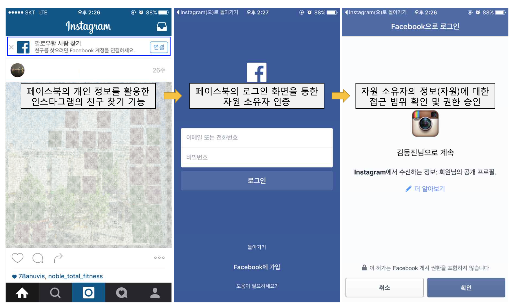
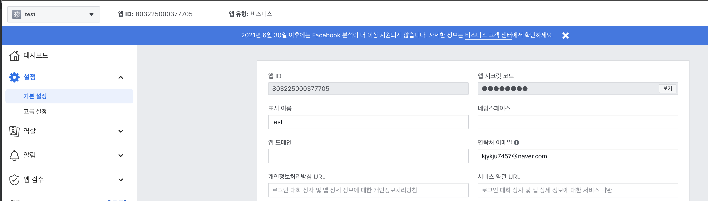
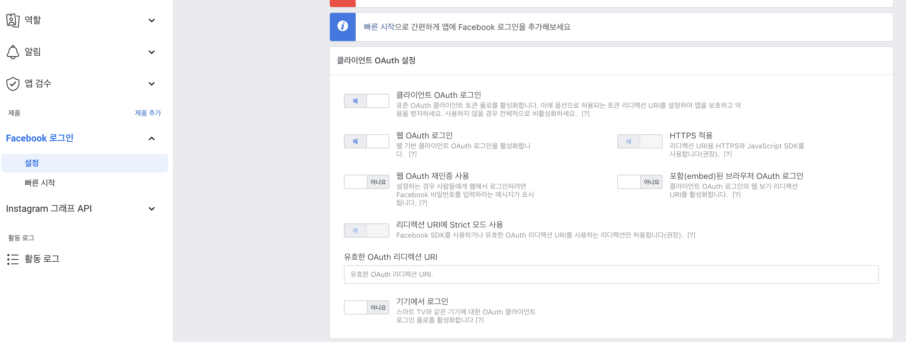
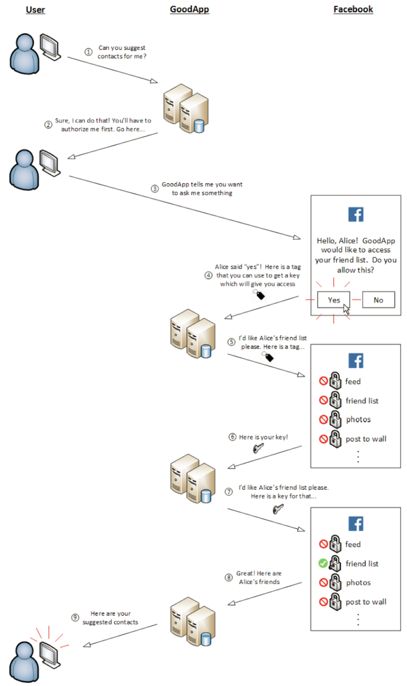
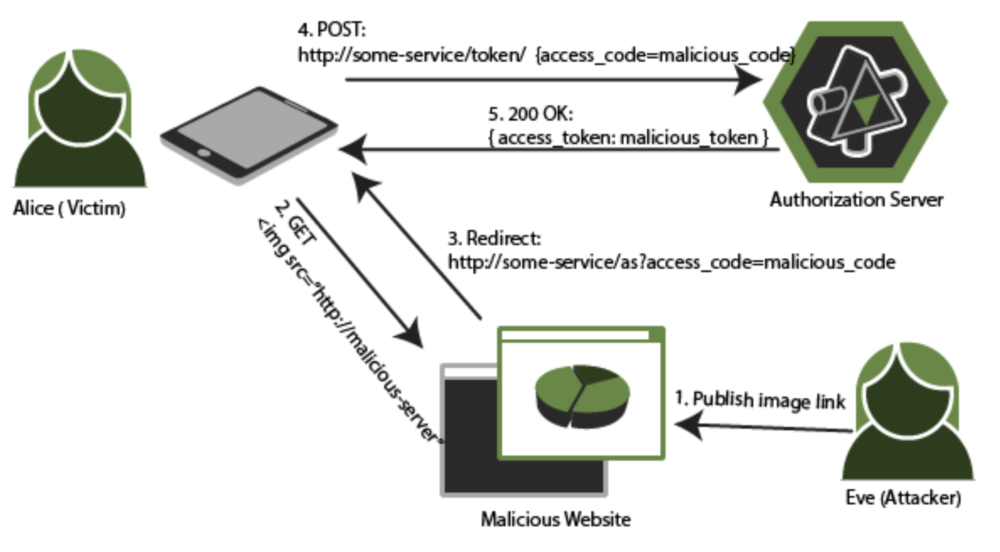

# oauth2.0

## oauth2.0 프로토콜의 정의
 - OAuth 2.0은 서로 다른 두 집단이 정보와 리소스를 안전하고 신뢰할 수 있는 방법으로 공유할 수 있게 해주는 프로토콜이다
 
### 인증과 인가
 - 인증 (authentication)
   - 누군가(또는 시스템)가 그들이 말하는 그 사람이 맞는지 실제로 확인하는 절차다
 - 인가 (authorization)
   - 일단 인증이 됐다면 당신이 하고자 하는 어떤 일을 할 수 있는 권한이 있는지 판단하는 절차다
    
### 인가 프레임워크 
 - 권한 위임(delegated authority)
   - 어떤 서비스나 애플리케이션이 사용자의 리소스에 대신 접근할 수 있는 것을 의미
    - ex. 
        - 인스타그램은 SNS 친구 찾기를 위해 페이스북의 오픈 API를 사용하여 자원 소유자의 친구 목록에 접근하며,
        이때 OAuth 2.0 기반으로 인증 및 권한 승인
    
### 기본용어

 - 리소스 소유자(Resource Owner): 클라이언트 어플리케이션이 접근하길 원하는 데이터를 가지고 있는 사용자이다.
 - 클라이언트(Client): 사용자의 데이터에 접근하고 싶어하는 어플리케이션이다.
 - 권한부여 서버(Authorization Server): 사용자로부터 권한을 부여받음으로써 클라이언트가 사용자의 데이터에 접근할 권한을 부여해주는 권한부여 서버이다.
 - 리소스 서버(Resource Server): 클라이언트가 접근하길 원하는 데이터를 갖고 있는 시스템이다. 때때로 권한부여 서버와 리소스 서버가 같은 경우가 있다.
 
 
 ### OAuth2.0 클라이언트가 되기 위한 네개의 단계
 
 1. 클라이언트 애플리케이션 등록
 2. access token 얻기
 3. access token 을 이용해서 보호된 리소스에 접근
 4. access token 갱신
     
 #### 클라이언트 애플리케이션 등록 과정
 
 - 애플리케이션 등록이 끝나면 아래와 같은 속성들에 대한 정보를 알게 된다
    - client id
    - client secret
    - redirection endpoint
    - authorization endpoint
    - token endpoint
    
 - 페이스북 개발자 페이지 (https://developers.facebook.com)
    1. 애플리케이션 생성(client id, client secret 결정)
        - 
    2. 리다이렉트 엔드포인트 설정 (리다이렉트 엔드포인트의 화이트리스트 결정)
        - 
    3. 인가 엔드포인트와 토큰 엔드포인트 설정(서비스 제공자가 문서로 제공)
        - 페이스북 인가 엔드포인트(https://www.facebook.com/v11.0/dialog/oauth)
        - 페이스북 토큰 엔드포인트(https://graph.facebook.com/oauth/access_token)
        - https://developers.facebook.com/docs/facebook-login 에 명시되어 있음
        
 
 #### 액세스 토큰 얻기
  - 인가 코드 그랜트(authorization code grant) 플로우(=서버사이드 플로우) 
    - GoodApp 클라이언트 애플리케이션이 Facebook 서비스 제공자의 친구 목록에 인가 요청을 하는 경우   
    - 
    <br/><br/><br/>
    
    1. 인가 요청
       ```
       GET /authorize?
            response_type=code&
            client_id=[CLIENT_ID]&
            redirect_uri=[REDIRECT_URI]&
            scope=[SCOPE]&
            state=[STATE] HTTP/1.1
       Host: server.example.com
       ```
    
      - response_type(필수) : 인가 코드 그랜트 플로우를 사용함을 나타냄. "code" 를 사용한다
      - client_id(필수) : 애플리케이션의 고유한 client id
      - redirect_uri(선택) : 서비스 제공자가 인가 요청에 대한 응답을 전달하기 위해 사용되는 리다이렉션 엔드포인트
      - scope (선택) : 요청하는 접근 범위를 나타낸다
      - state(권장) : 옵션이지만 사용하는 것이 좋다. CSRF 공격을 막을 수 있다  
    <br/>
      
    2. 인가 응답 
     - 인가 요청 URL에 질의를 보내면 사용자는 사용자 동의화면을 보게 되고, 사용자는 인가 요청에 동의하거나 거절할 수 있다
        - 만약 동의하면 그에 대한 응답으로 액세스 토큰과 교환할 수 있는 인가 코드(authorization code)가 전달된다
     
     - 인가 요청을 승인할 경우
        -   ```
               HTTP/1.1 302 Found
               Location: [REDIRECT_URI]?
                        code=[AUTHORIZATION_CODE]&
                        state=[STATE]     
            ```    
        
        - code(필수) : 액세스 토큰과 교환하는데 사용하는 인가 코드
        - state(조건부로 필수) : 만약 state 파라미터가 인가 요청에 존재했으면,
           그에 대한 응답에도 state 파라미터가 존재해야 한다     
      
        - 인가 코드는 액세스 토큰과 단 한번 교환할 수 있다. 즉 소모품이다.
        - 인가 코드는 일반적으로 짧은 만료 시간을 가진다(10분을 넘어가지 않도록 제한)
    
     - 인가 요청을 거부한 경우
         -   ```
               HTTP/1.1 302 Found
               Location: [REDIRECT_URI]?
                        error=[ERROR_CODE]&
                        error_description=[ERROR_DESCRIPTION]&
                        error_uri=[ERROR_URI]&
                        state=[STATE]     
            
         - error(필수) : 에러 코드로서 인가 요청이 실패한 경우를 나타냄. 다음 값 중 하나여야 함
            - invalid_request : 요청 데이터가 잘못돼서 처리할 수 없음
            - unauthorized_client : 클라이언트 애플리케이션이 요청을 전달할 권한이 없음 
            - access_denied : 사용자가 인가 요청을 거부함 
            - unsupported_response_type : 잘못된 응답 유형이 사용됨. (response_type=code 가 아닌 경우)
            - invalid_scope : 잘못된 범위가 사용됨
            - server_error : 서버 내에서 에러가 발생해 인가 요청을 제대로 처리할 수 없음 
            - temporarily_unavailable : 인가 서버가 일시적인 장애임 
          
         - error_description(선택) : 사람이 읽을 수 있는 형태의 메시지
         - error_uri(선택) : 에러에 대해 자세한 정보를 담고 있는 웹 문서에 대한 링크
         - state(조건부로 필수) : 인가 요청에도 state 파라미터가 존재하면 요청에 대한 응답에도  
                               state 값이 전달돼야 한다  
      <br/>                        

    3. 액세스 토큰 요청
     - 서비스 제공자의 토큰 엔드포인트로 POST 요청을 보낸다 
     -   ```
           POST /token HTTP/1.1
           Host: server.example.com
           Authorization: Basic [ENCODED_CLIENT_CREDENTIALS]
           Content-Type: application/x-www-form-urlencoded
         
           grant_type=authorization_code&
           code=[AUTHORIZATION_CODE]&
           redirect_uri=[REDIRECT_URI]&
           client_id=[CLIENT_ID]
                       
         ```
     - grant_type(필수) : 액세스 토큰으로 교환되고자 한다는 것을 나타내기 위해 authorization_code로 세팅돼야 한다
     - code(필수) : 인가 요청에 의해 전달받은 인가 코드 값
     - redirect_uri(조건부로 필수) : 인가 요청에 redirect_uri가 포함된다면, 
                                  액세스 토큰 요청에도 redirect_uri가 포함돼야 하며,
                                  인가 요청 시 사용된 URI와 동일해야 한다
        
     - client_id(필수) : 애플리케이션의 고유한 client id 
     - HTTP basic authentication을 이용해서 클라이언트 애플리케이션을 서비스 제공자에게 인증한다 
        - [ENCODED_CLIENT_CREDENTIALS] = BASE 64 ENCODE([CLIENT_ID]:[CLIENT_SECRET])
     <br/>
     
     4. 액세스 토큰 응답 
      - 액세스 토큰 요청이 성공했을 때
        - access_token(필수) : 얻고자 했던 액세스 토큰. 이 토큰을 이용해 사용자의 프로파일이나 글에 접근가능
        - token_type(필수) : 전달되는 토큰의 유형. 일반적으로 bearer
        - expires_in(선택) : 토큰의 유효 기간(초 단위)
        - refresh_token(선택) : 액세스 토큰이 만료됐을 경우 액세스 토큰을 갱신하기 위해 사용되는 토큰
                               서비스 제공자에 따라 리프레시 토큰을 지원하지 않는 경우도 있을 수 있다
        - scope(조건부로 필수) : 인가된 접근 범위와 요청된 범위가 일치한다면 생략.
                              만약 다르다면 인가된 범위가 전달된다
                               
      - 액세스 토큰 요청이 실패했을 때 
        - error(필수) : 에러 코드로서 요청이 실패한 이유를 나타낸다. 다음의 값 중 하나
            - invalid_request : 잘못된 액세스 토큰 요청(필요한 파라미터가 빠졌거나 지원하지 않는 파라미터 값 포함)
            - invalid_client : 클라이언트 인증 실패(등록되지 않은 클라이언트, 액세스 토큰 요청에 클라이언트 인증이 포함되지 않은 경우)
            - invalid_grant : 인가 코드나 리프레시 토큰이 만료되거나 폐기된 경우, 
                              인가 요청에서 사용된 리다이렉션 URI와 동일한 URI가 사용되지 않은 경우
            - unauthorized_client : 인증된 클라이언트가 인가 코드 그랜트를 사용할 권한이 없음 
            - unsupported_grant_type : 인가 서버가 지원하지 않는 그랜트 유형을 사용 
            - invalid_scope : 요청된 접근 권한 범위가 잘못됐거나 사용자가 허락한 범위를 넘어서는 경우
        - error_description(선택) : 사람이 읽을 수 있는 형태의 아스키 문자열 메시지로 에러에 대한 추가적인 정보 제공
        - error_uri(선택) : 에러에 대한 자세한 정보를 담고 있는 웹 페이지의 URI 

#### 액세스 토큰 이용

  - API를 호출할 때 액세스 토큰을 전달하는 방법에는 3가지가 있다
    - authorization header 에 담아서 전달 (가장 권장되는 방식)
        ```
           GET /resource HTTP/1.1
           Host: server.example.com
           Authorization: Bearer mF_9.B5f-4.1JqM     
        ```
    - HTTP POST 방식으로 Body에 담아서 전달 (authorization header 사용이 불가능할 때 사용)
       ```
          POST /resource HTTP/1.1
          Host: server.example.com
          Content-Type: application/x-www-form-urlencoded
      
          access-token=mF_9.B5f-4.1JqM      
        ```
    - URI QUERY STRING으로 전달(테스트와 디버깅 용도로 사용)
        ```
           GET /resource?access_token=mF_9.B5f-4.1JqM HTTP/1.1
           Host: server.example.com 
        ```
#### 액세스 토큰 갱신

   - 액세스 토큰은 제한 시간이 지나면 만료되고, 만료되면 다시 갱신해야 한다 
   - 리프레시 토큰(refresh token) 을 이용해 access token 을 갱신하는 플로우
    - 선택 사항. 서비스 제공자가 리프레시 토큰 워크플로우를 지원하지 않을수도 있다 
     
    
   - 리프레시 요청 
     ```
       POST /token HTTP/1.1
       Host: server.example.com
       Authorization: Basic [ENCODED_CLIENT_CREDENTIALS]
       Content-Type : application/x-www-form-urlencoded
     
       grant_type=refresh_token&refresh_token=[REFRESH_TOKEN]
     ```
     - grant_type (필수) : 리프레시 토큰을 이용해 새로운 액세스 토큰을 요청한다는 것을 나타내기 위해 "refresh token" 으로 고정 해야한다
     - refresh_token (필수) : 리프레시 토큰 값 
     - scope(선택) : 새로 요청하는 액세스 토큰 접근 권한 범위가 기존 액세스 토큰과 동일하다면 생략 가능.
                    기존 액세스 토큰의 접근 권한 범위보다 작은 범위의 액세스 토큰을 요청할 수 있다.
                    원래의 액세스 토큰보다 더 큰 접근 범위를 요청할 수는 없다 
   
   - 리프레시 응답 포맷은 액세스 토큰 응답과 동일

   - 리프레시 토큰의 유효 기간(며칠~몇 주)은 액세스 토큰의 유효 기간(몇분~몇시간)보다 길다
   - 리프레시 토큰이 만료된 경우 인가 프로세스를 처음부터 다시 시작해야 한다
   - 리프레시 토큰을 사용하면 사용자의 세션이 유지되고 매끄러운 사용자 경험을 제공할 수 있다
   
#### state 파라미터로 CSRF 공격 방지

  - 공격 원리
     
    1. 공격자는 미리 자신의 인가 코드(malicious_code)를 얻어 놓는다(user-agent에서 인가 코드를 얻은 직후 인가 플로우를 중지한다) 
    2. 공격자는 공격용 website를 만들고 html의 img 태그의 src 속성에 공격용 website 주소를 넣는다
    3. 희생자는 공격용 website를 클릭하고 자신도 모르게 희생자의 user-agent가 redirect 응답을 받는다.
    4. redirect로 인해 공격자의 인가 코드로 access token 발급 요청이 이뤄진다
    5. 최종적으로 희생자는 공격자의 access token을 받게 된다.
    6. 이후에 희생자가 리소스 서버의 api 를 호출할 때 공격자의 access token를 사용하면 자신의 데이터를 공격자의 계정에 올리게 되는 보안 위협이 생길 수 있다
  
  - state 파라미터로 방어하는 방법 
    - 희생자가 access token 요청을 보내기 전에 state 파라미터를 확인해서 자신의 state가 아니면 access token 요청을 보내지 않는다
    
    

#### 참고 자료 
 - [OAuth 2.0 마스터 (OAuth 2.0 애플리케이션 개발을 위한 모든 것), 에이콘(찰스 비히스)](http://www.yes24.com/Product/goods/38100766)
 - [CSRF 공격 방지 원리](https://stackoverflow.com/questions/35985551/how-does-csrf-work-without-state-parameter-in-oauth2-0)